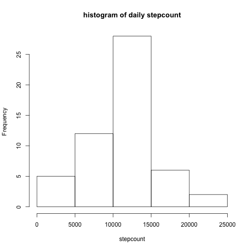
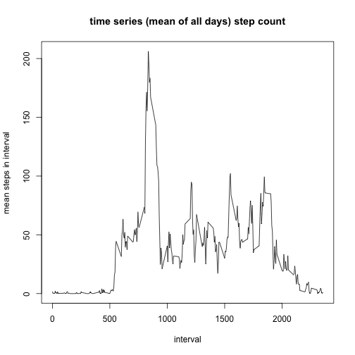
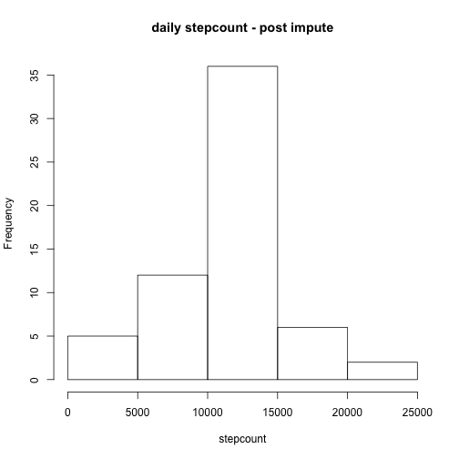
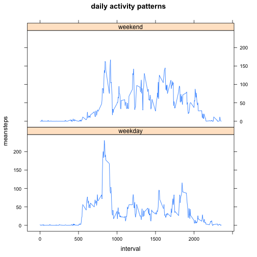

## Loading and preprocessing the data
test that the data file has been unzipped into the working directory  

if not check that the source zip file is here,  

if so, the archive only contains a single file so simply unzip it else   

get it and then read in the file and convert date column to date type


```r
# load the libraries that we are goign to need
library(data.table)
library(dplyr)
library(lattice)
# check file and unzip as required
if (file.exists('activity.csv')){#donothing
        }else{
                if(!file.exists('activity.zip')){
                        # get file from the link
                        con<- "https://d396qusza40orc.cloudfront.net/repdata%2Fdata%2Factivity.zip"
                        download.file(con, "activity.zip", method = 'curl')        
                        unzip("activity.zip")
                }else{
                        unzip("activity.zip")
                        }
}
# 
activity <- read.csv(file = 'activity.csv', header = TRUE, stringsAsFactors = FALSE)
activity$date <- as.Date(activity$date)
```

## What is mean total number of steps taken per day?
Group the data by day and use sum  

I leave the breaks calculation on the histogram to R as this works nicely

```r
# group data by date and use sum() fuction to total
daysum <- aggregate(activity$steps~activity$date, activity, sum)
names(daysum) <- c("date", "stepcount")
hist(daysum$stepcount, main = "histogram of daily stepcount", xlab = "stepcount")
```

 

```r
# display five number summary inc nea and median
summary(daysum$stepcount)
```

```
##    Min. 1st Qu.  Median    Mean 3rd Qu.    Max. 
##      41    8841   10760   10770   13290   21190
```

## What is the average daily activity pattern?
Group by interval and use mean() to average  

The interval code is of the form hHMM where h can be absent) but this maps nicely  

so we can leave it as an integer expecting last data point to be 2355

```r
intervalav <- aggregate(activity$steps~activity$interval, activity, mean)
names(intervalav) <- c("interval", "averagesteps")
plot(intervalav$interval ,intervalav$averagesteps, type = 'l',
     main = "time series (mean of all days) step count",
     xlab = "interval", ylab = "mean steps in interval")
```

 

```r
stepsmaxinterval <- intervalav[which.max(intervalav$averagesteps),1]
```
So the maximum average step count occurs at interval 835  
Note when using a line graph the fact that data is NOT continuous is masked  
(no values for intervals at miunte 60 - 95 can exist)

## Imputing missing values
We are goign to use data.tables to replace all NA interval figures with the interval average figures from before  

[source link to stack overflow](http://stackoverflow.com/questions/7971513/using-one-data-frame-to-update-another)  

note i'm suppressing the typecast warnings here:

```r
nullroes <- activity[is.na(activity$steps),]
part1 <- nrow(nullroes)
nullroes.dt <- data.table(nullroes, key = c("date", "interval"))
activi.dt <- data.table(activity, key = c("date", "interval"))
intervalav.dt <- data.table(intervalav, key = c("interval"))
nullroes.dt$steps <- intervalav$averagesteps
activi.dt[nullroes.dt] <- nullroes.dt
newactidf <- as.data.frame(activi.dt)
newdaysum <- aggregate(newactidf$steps~newactidf$date,newactidf, sum)
names(newdaysum) <- c("date", "stepcount")
hist(newdaysum$stepcount , main = "daily stepcount - post impute", xlab = "stepcount")
```

 

```r
summary(newdaysum$stepcount)
```

```
##    Min. 1st Qu.  Median    Mean 3rd Qu.    Max. 
##      41    9819   10640   10750   12810   21190
```
So we can see that there were 2304 NA rows in the data set.  

Perhaps not surprisingly, replacing NA's with our average hasnt changed the  

median and mean in the histogram much but the central frequency's magnitude has increased


## Are there differences in activity patterns between weekdays and weekends?

```r
new2actidf <- mutate(newactidf, 
                     wendind = ifelse(grepl("^S", 
                        weekdays(newactidf$date)),yes = "weekend", no = "weekday"))
new2actidf$wendind <- as.factor(new2actidf$wendind)
str(new2actidf)
```

```
## 'data.frame':	17568 obs. of  4 variables:
##  $ steps   : int  1 0 0 0 0 2 0 0 0 1 ...
##  $ date    : Date, format: "2012-10-01" "2012-10-01" ...
##  $ interval: int  0 5 10 15 20 25 30 35 40 45 ...
##  $ wendind : Factor w/ 2 levels "weekday","weekend": 1 1 1 1 1 1 1 1 1 1 ...
```

```r
new3actidf <- aggregate(new2actidf$steps~new2actidf$interval + new2actidf$wendind,
                        new2actidf, mean)
names(new3actidf) <- c("interval", "wendind", "meansteps")
str(new3actidf)
```

```
## 'data.frame':	576 obs. of  3 variables:
##  $ interval : int  0 5 10 15 20 25 30 35 40 45 ...
##  $ wendind  : Factor w/ 2 levels "weekday","weekend": 1 1 1 1 1 1 1 1 1 1 ...
##  $ meansteps: num  2.1556 0.4 0.1556 0.1778 0.0889 ...
```

```r
xyplot(meansteps~interval|wendind, data = new3actidf, type ='l', 
       layout = c(1,2),
       main = 'daily activity patterns')
```

 
  
So we can see that weekend activiy patterns have a similar (but less intense)  

morning peak but then have a more peaky pattern throughout the day
